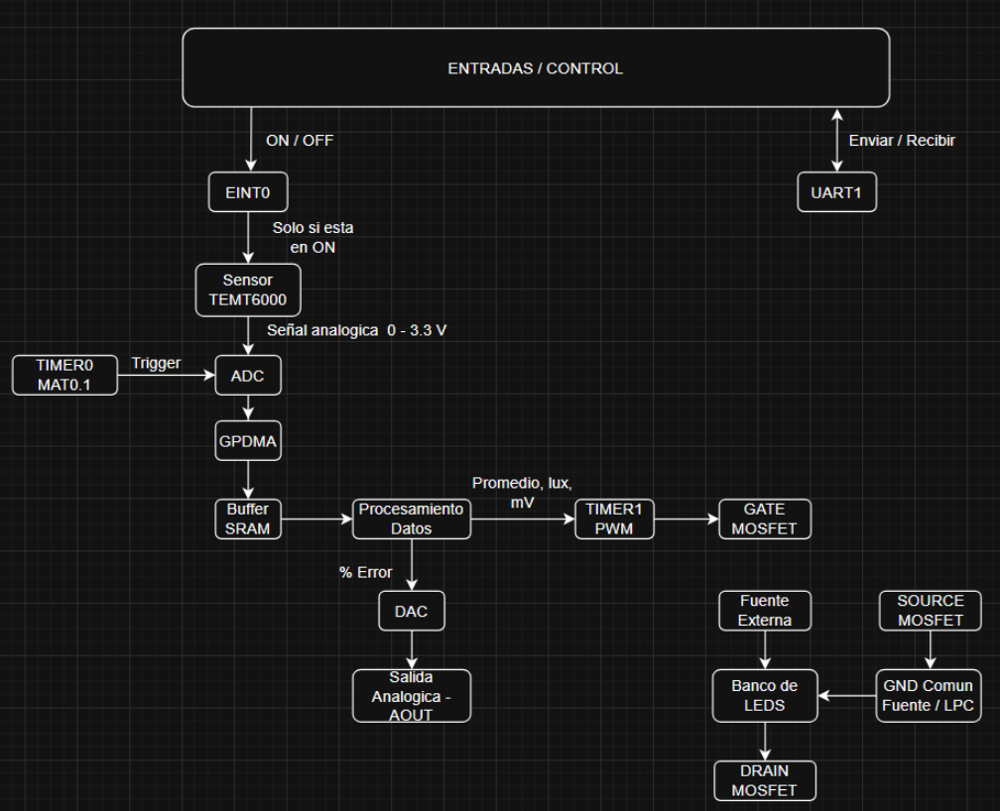
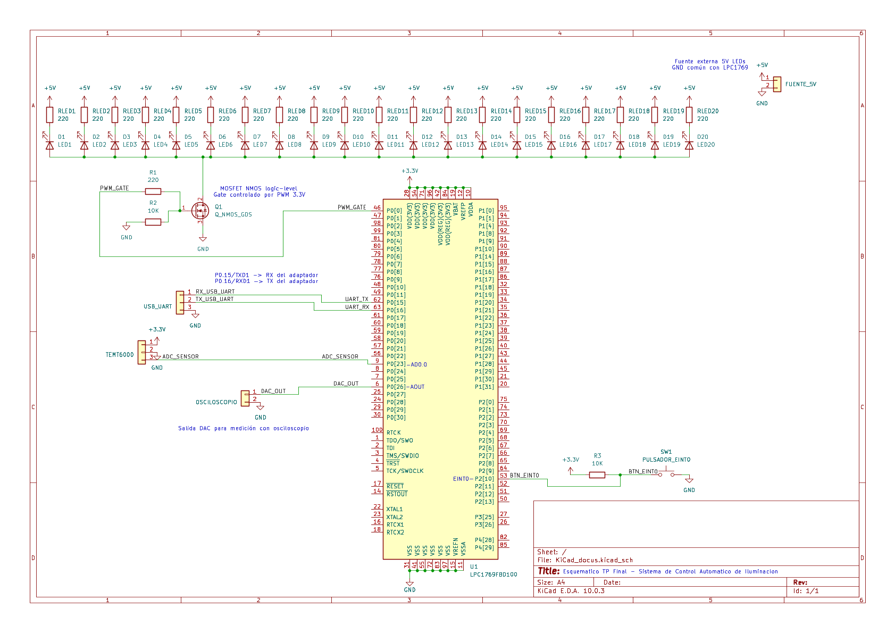
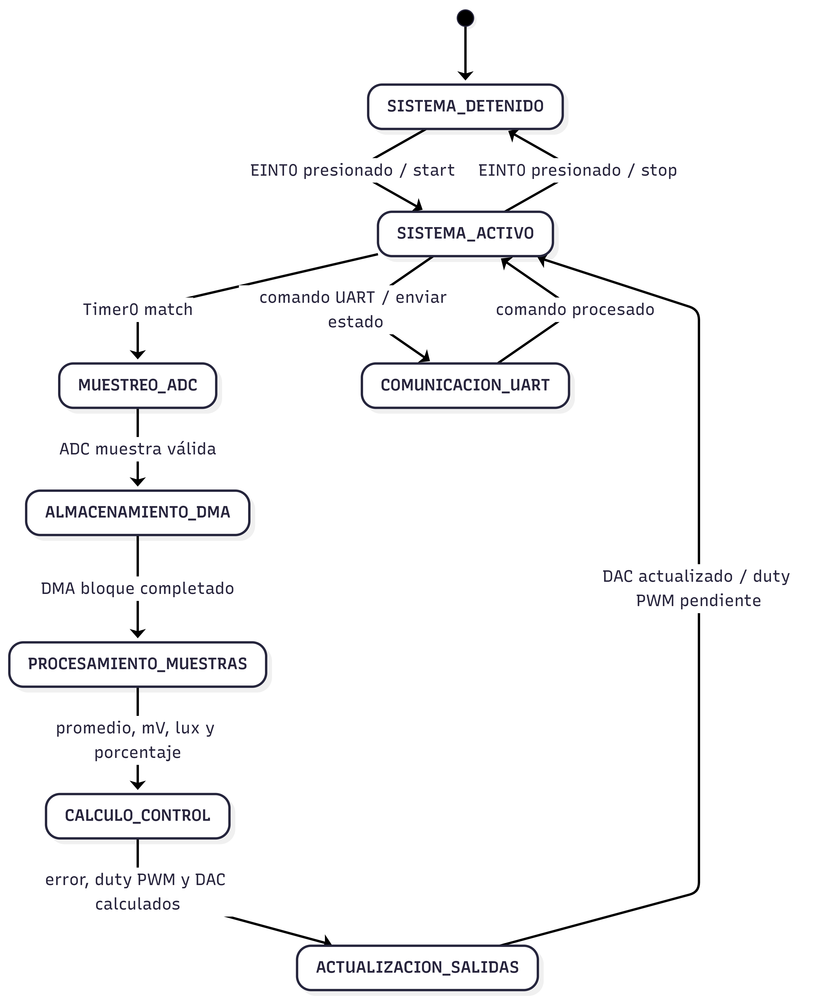

# Sistema de Compensacion Automático de Iluminación
> **Asignatura:** Electrónica Digital III - Universidad Nacional de Córdoba
> 
> **Integrantes:**
> * Martina Ciruzzi
> * Mauricio Agustin Herrera
> 
> **Profesor:** Marcos Blasco

---

## 🚀 1. Descripción General del Proyecto

El proyecto consiste en un sistema automático de control de iluminación para ambientes interiores, implementado sobre el microcontrolador LPC1769. El sistema mide la luz ambiente mediante un sensor, permite que el usuario defina un nivel de iluminación deseado y regula automáticamente la intensidad de una carga lumínica para acercarse a ese valor.

Este desarrollo busca mantener una iluminación estable frente a variaciones externas, como cambios en la luz natural o en las condiciones del ambiente, reduciendo la necesidad de ajustes manuales. Está dirigido a aplicaciones educativas, de automatización básica y de control de iluminación en espacios interiores, donde se requiera una solución simple, configurable y monitoreable desde una terminal serie.


### 🎯 Alcances del Proyecto (¿Qué hace y qué NO hace el sistema?)

**El sistema SÍ es capaz de:**

- Medir la iluminación ambiente mediante un sensor TEMT6000 conectado al ADC del LPC1769.
- Adquirir muestras periódicas usando Timer0 y almacenarlas automáticamente mediante GPDMA.
- Calcular un valor promedio de iluminación a partir de un bloque de muestras.
- Convertir la medición obtenida a milivolts, lux aproximados y porcentaje de iluminación.
- Recibir por UART un porcentaje de iluminación deseado entre 0 % y 100 %.
- Regular una carga lumínica mediante una señal PWM aplicada al gate de un MOSFET.
- Entregar por DAC una tensión proporcional a la medición de iluminación.
- Reportar por UART el estado del sistema, incluyendo valor deseado, medición, error y duty aplicado.
- Arrancar y detener el funcionamiento mediante un pulsador conectado a EINT0.

**El sistema NO incluye:**

- Conexión por Wi-Fi o Bluetooth.
- Guardado de datos en memoria o tarjeta SD.
- Interfaz gráfica para ver los datos.
- Diseño en PCB.
- Alimentación con batería.


### ⏩ Posibles Etapas Siguientes (Líneas Futuras)

En una versión futura del proyecto se podrían implementar las siguientes mejoras:

- Migrar el circuito armado en protoboard a un circuito impreso (PCB) para obtener un montaje más prolijo, seguro y estable.
- Agregar conectividad inalámbrica, como Wi-Fi o Bluetooth, para monitorear el sistema de forma remota.
- Diseñar una interfaz gráfica, ya sea en una aplicación de escritorio o móvil, para visualizar la luz medida, el valor deseado y el duty aplicado.
- Incorporar almacenamiento de datos para guardar mediciones históricas de iluminación.
- Agregar un modo de bajo consumo para reducir el consumo cuando el sistema se encuentre detenido.

---

## 📐 2. Arquitectura del Sistema: Hardware y Software

### 🔌 Hardware & Interconexión
* **Diagrama de Bloques:** 




* **Esquemático del Circuito:** 



  
### Descripción del Circuito y Consideraciones de Diseño

El circuito está organizado en etapas funcionales. La primera etapa corresponde a la **adquisición de luz ambiente**, realizada mediante el sensor TEMT6000. Este sensor entrega una señal analógica proporcional a la iluminación recibida, la cual se conecta al canal **AD0.0 del LPC1769, pin P0.23**. Dicha señal es digitalizada por el ADC del microcontrolador para obtener una representación numérica del nivel de luz presente en el ambiente.

La segunda etapa corresponde al **procesamiento y almacenamiento de muestras**. Las conversiones del ADC son disparadas periódicamente por el **Timer0**, utilizando la señal de match como evento de disparo. Luego, el **GPDMA** transfiere automáticamente las muestras obtenidas hacia una zona de memoria SRAM, reduciendo la carga de trabajo del procesador. Una vez completado el bloque de muestras, el firmware calcula un valor promedio para disminuir variaciones instantáneas y obtener una medición más estable.

La tercera etapa es la **etapa de control de iluminación**. A partir del porcentaje de luz medido y del porcentaje deseado ingresado por el usuario, el sistema calcula un error y determina el ciclo de trabajo de una señal PWM. Esta señal es generada mediante el **Timer1** y se entrega por el pin **P0.0**, conectado al gate de un MOSFET. El MOSFET funciona como etapa de potencia, permitiendo regular la corriente aplicada a la luminaria sin exigir corriente directamente al pin del microcontrolador.

Además, el sistema incorpora una salida analógica de monitoreo mediante el **DAC del LPC1769**, disponible en el pin **P0.26 / AOUT**. Esta salida entrega una tensión en mV proporcional al nivel de luz medido en lux, permitiendo observar externamente el comportamiento del sistema mediante un multímetro u osciloscopio.

La comunicación con el usuario se realiza mediante **UART1**, utilizando los pines **P0.15 como TXD1** y **P0.16 como RXD1**. Por este medio se recibe el porcentaje de iluminación deseado y se transmite el estado del sistema. También se incluye una entrada externa mediante **EINT0 en P2.10**, utilizada para iniciar o detener el funcionamiento del sistema mediante un pulsador.

Como consideración de diseño, se separa la etapa lógica de control de la etapa de potencia. El LPC1769 opera con niveles de **3,3 V**, por lo que el MOSFET permite manejar la carga de iluminación sin sobrecargar los pines del microcontrolador. Además, se utiliza un promedio de muestras ADC para reducir ruido o fluctuaciones propias de la medición analógica.
La fuente externa de la carga lumínica comparte GND con la placa LPC1769, lo cual permite que la señal PWM tenga una referencia común para controlar correctamente el MOSFET.

### 💻 Arquitectura de Software (Firmware)

* **Diagrama de Flujo o Máquina de Estados:**




---

## ⚡ 3. Especificaciones Eléctricas, Alimentación y Entorno

### 🔌 Parámetros de Alimentación y Consumo 
* **Tensión de operación del sistema:** 3.3V (lógica del LPC1769) y 7V (alimentación del LED de potencia vía MOSFET)
* **Método de alimentación:** Placa LPC1769: alimentación por USB (5V) con regulador interno a 3.3V -  Etapa de potencia (Carga LED externa controlada por un MOSFET IRLZ44N): fuente externa de 7V - Sensor TEMT6000: 3.3V tomados directamente de la placa
* **Consumo estimado o medido:**
  * En modo activo (Depende principalmente de la corriente de la carga LED externa y del duty aplicado. Se estima para la etapa LED + MOSFET en máxima conducción.): `300 - 600 mA`
  * En modo bajo consumo (Estado Detenido - Solo LPC1769 + Sensor): `55 mA medidos aproximadamente`

* **IDE y SDK:** MCUXpresso IDE v11.x con drivers CMSIS v2p00 para LPC17xx refactorizados por David Trujillo Medina (versión 2026)
* **Microcontrolador Principal:** NXP LPC1769
* **Bibliotecas de Terceros y Versiones:** No se utilizaron bibliotecas de terceros adicionales
* **Periféricos Avanzados Utilizados:** NVIC, GPDMA, SysTick, DAC, ADC, Timer, UART, EINT
* **Estrategia de Concurrencia:** El sistema utiliza arquitectura bare-metal orientada a interrupciones, sin RTOS. El main loop actúa como despachador de tareas diferidas de baja prioridad, mientras que toda la lógica de tiempo real se ejecuta en ISR.
* Arquitectura de interrupciones y prioridades:
  * UART1_IRQHandler : Prioridad ( 0 ) (máxima) - Recepción de comandos por teclado
  * EINT0_IRQHandler : Prioridad ( 2 ) - Arranque y parada del sistema
  * DMA_IRQHandler : Prioridad ( 1 ) - Procesamiento de bloque ADC, cálculo de error, duty PWM y DAC
  * TIMER1_IRQHandler : Prioridad ( 3 ) - Generación de PWM, aplicación del duty pendiente al inicio del período
  * SysTick_Handler: Prioridad ( fijo CM3 ) - Contador de 2 segundos para reporte UART periódico
* Mecanismo para PWM con doble buffer:
  * Al completarse un bloque de muestras, el DMA dispara una interrupción. En el handler correspondiente se procesa el bloque, se calcula el promedio, el error y el nuevo duty pendiente.
* Comunicación ISR → main loop via flags volátiles:
  * enviar_estado, aviso_arranque y comando_listo son flags que las ISR activan y el main consume. Esto evita ejecutar UART_Send BLOCKING dentro de interrupciones, que era la causa original del congelamiento del sistema.

---

## 🔄 4. Proceso de Integración y Desarrollo

A continuación se describe el proceso de integración seguido durante el desarrollo del sistema.

* **Etapa 1 (Validación inicial):** Se configuró el pin P0.0 como salida GPIO y se verificó el encendido del LED de prueba. Se configuró el Timer1 con PWM por software y se validó la señal con osciloscopio, probando manualmente distintos valores de duty via cambios en el código. Se verificó también que el MOSFET respondía correctamente a la señal PWM generada.
* **Etapa 2 (Adquisición/Comunicación):** Se implementó el ADC con trigger por Timer0 (MAT0.1 en toggle) y se enviaron los valores crudos de 12 bits por UART1 a 9600 baud. Se detectó en esta etapa que UART_Send BLOCKING a 9600 baud generaba períodos de bloqueo demasiado largos. Se migró a 115200 baud y se ajustaron las prioridades del NVIC, con UART1 en prioridad 0 para evitar que Timer1 interrumpiera la transmisión. Se validó la recepción de comandos numéricos por teclado con eco de confirmación.
* **Etapa 3 (Integración lógica):** Se incorporó el GPDMA con LLI circular para transferir automáticamente las conversiones del ADC al buffer en SRAM (0x2007C000). Se eliminó la interrupción del ADC, delegando todo el flujo al DMA. Se tomaron mediciones empíricas del sensor TEMT6000 con un luxómetro a distintos niveles de iluminación, construyendo la tabla de calibración de 6 tramos (luego extendida a 7) con interpolación lineal por tramos en aritmética entera. Se detectó y corrigió el problema del 1% detectado como 0% ajustando el primer tramo para devolver 1 directamente en lugar de aplicar división entera. Se agregó el DAC con salida proporcional al voltaje medido por el sensor, verificable con osciloscopio.
* **Etapa 4 (Sistema Completo):** Se integró la lógica de control completa: cálculo de error, zona muerta de ±2% para eliminar el parpadeo del PWM cerca del setpoint, y doble buffer duty_pwm/duty_pwm_pendiente para aplicar cambios de duty solo al inicio del período. Se realizaron pruebas de estrés subiendo el nivel de luz del ambiente al máximo, donde se detectó el congelamiento del UART por acumulación de flags del SysTick. Se corrigió reseteando contador_2_segundos al procesar cada comando y cancelando flags pendientes. Se calibraron los valores MV_MAXIMO = 3133 mV y LUX_MAXIMO = 776 lux, usados como referencia para la conversión de la medición a porcentaje midiendo el voltaje real del sensor a máxima iluminación con luxómetro. Se validó el sistema completo en la caja controlada con el foco LED regulable desde el celular como fuente de luz del ambiente.

---

## 📊 5. Ensayos, Pruebas y Resultados
Se realizaron pruebas funcionales sobre adquisición, comunicación, control PWM y salida DAC.

* **Pruebas Funcionales Realizadas:**
  * Se testeo la obtencion de los datos del Sensor TEMT6000 regulando la luz ambiente, verificando si los datos obtenidos por el sensor coincidian con los porcentajes inyectados, ademas se testeo si respondia correctamente el PWM cuando se llegaba al valor del SetPoint y si la comunicacion Serie estaba en correcto funcionamiento
  * Se testeo la salida del DAC variando la intensidad luminica del ambiente


* **Evidencia Fotográfica y Gráficos:**  Disponibles en el archivo `docs/README.md`, incluyendo capturas de instrumental y fotos del prototipo final.
---

## 📂 6. Estructura del Repositorio

```text
├── firmware/          # Código fuente del proyecto (MCUXpresso)
│   ├── src/           # Archivos de código (.c)
│   └── inc/           # Archivos de cabecera (.h)
├── hardware/          # Captura y PDF del esquemático desarrollado en KiCad
├── docs/              # Datasheets clave, imágenes del README
└── README.md          # Este archivo de presentación
```
